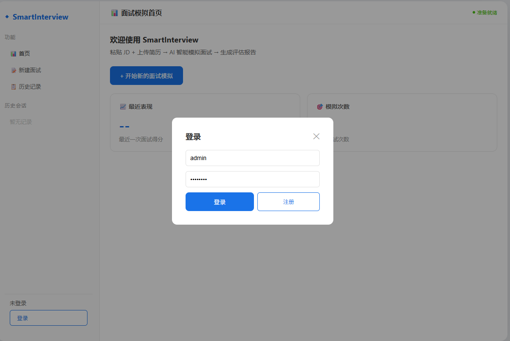
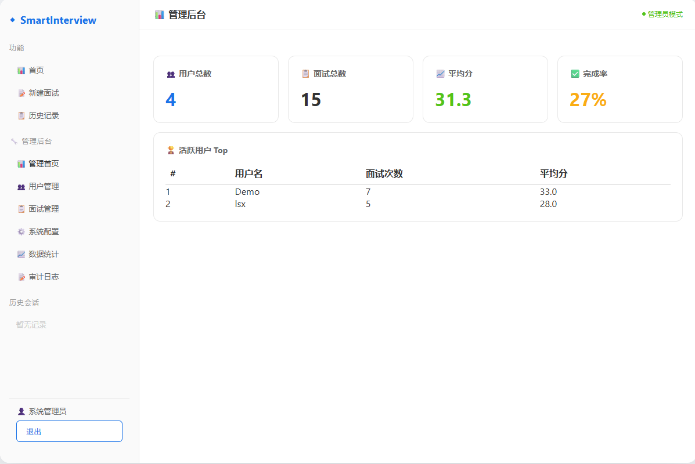
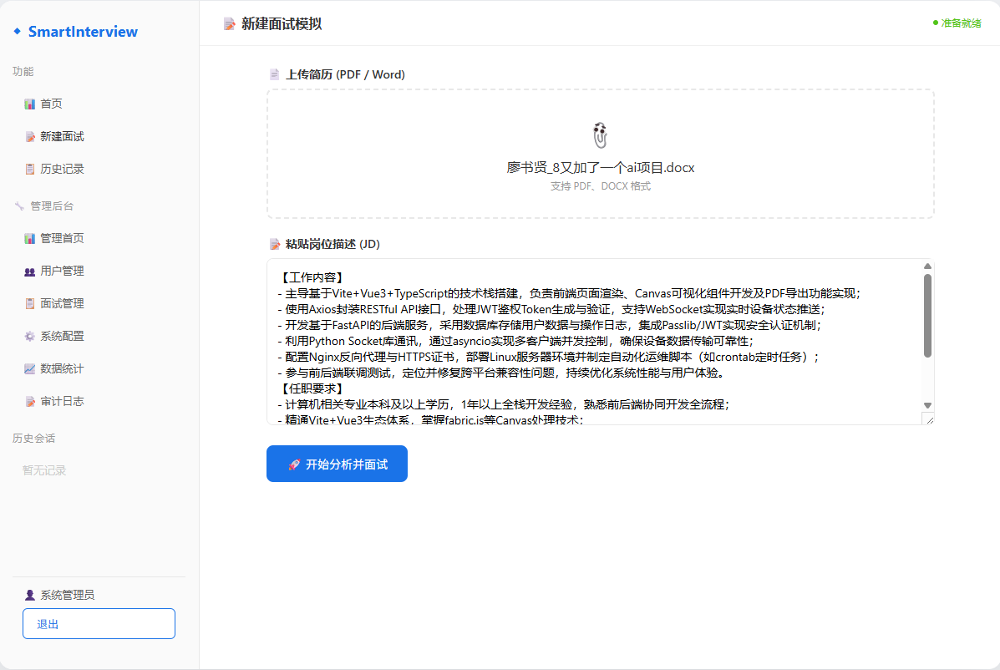
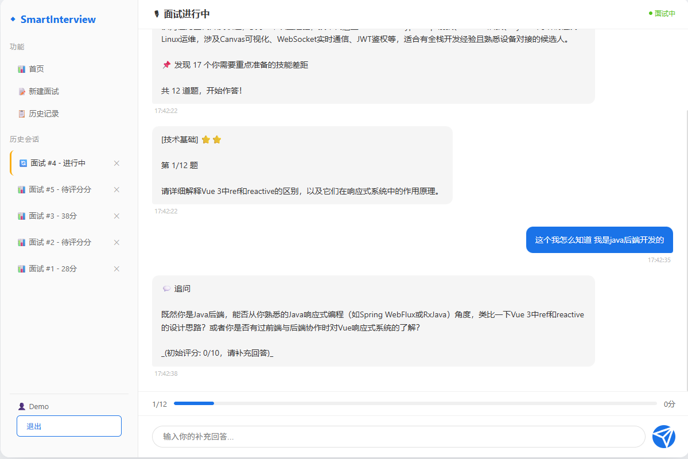
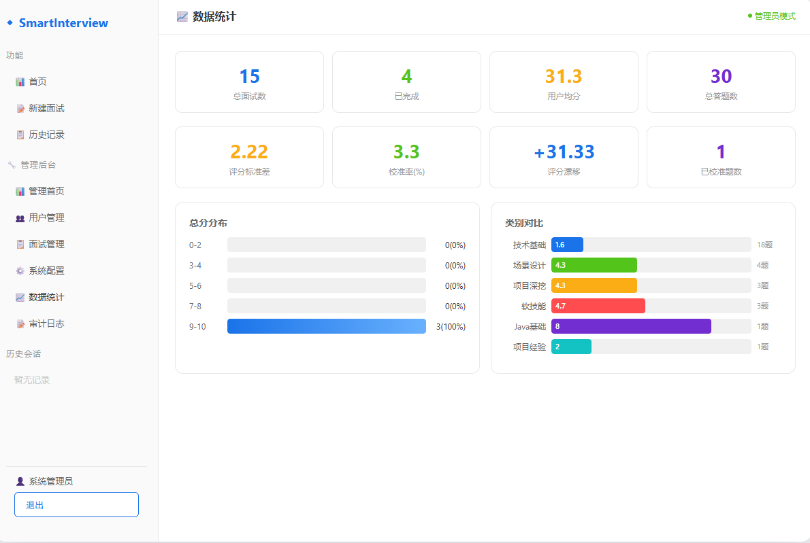
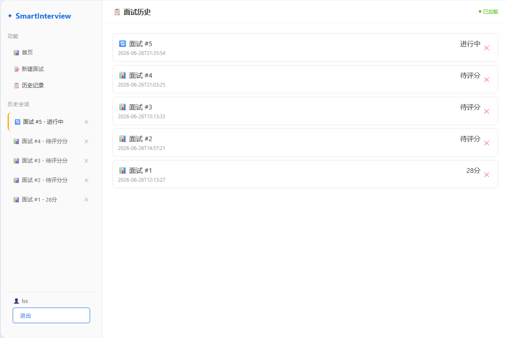
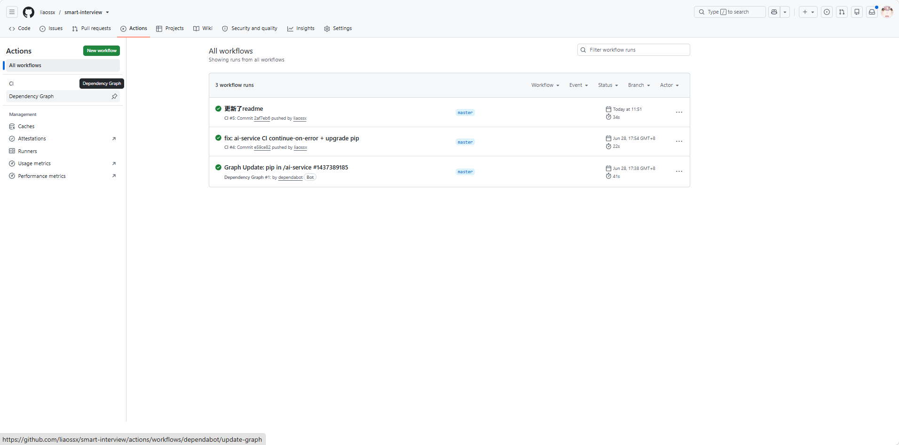

# Smart Interview — AI 面试平台

基于大语言模型的智能面试系统，支持 JD 驱动出题、实时问答评分、多维度面试报告分析。

## 技术栈

- **后端**：Java 17 + Spring Boot 3.2.5 + Spring Security + JPA + Flyway
- **AI 服务**：Python 3.11 + FastAPI + LangGraph
- **前端**：原生 JavaScript + 模块化架构
- **数据库**：MySQL 8.0
- **部署**：Docker + Docker Compose（多阶段构建 + 健康检查 + 自动重启）
- **CI/CD**：GitHub Actions

## 核心功能

- JWT 认证与权限控制（用户/管理员角色）
- JD 输入 + 简历上传，AI 生成个性化面试题
- 实时面试问答，支持追问
- AI 自动评分 + 逐题反馈 + 面试总结报告
- 管理后台：会话统计、分数分布、分类分析、评分质量监控
- 面试历史记录管理

## 系统架构

```
┌─────────┐     HTTP/JSON     ┌─────────┐     HTTP/JSON     ┌──────────┐
│  前端    │ ──────────────→ │  后端    │ ──────────────→ │ AI 服务  │
│ :3000   │                  │ :8080   │                  │ :8001    │
└─────────┘                  └────┬────┘                  └──────────┘
                                  │
                                  ▼
                             ┌─────────┐
                             │ MySQL   │
                             │ :3306   │
                             └─────────┘
```

## 项目截图

### 1. 登录页面



### 2. 仪表盘首页



### 3. 新建面试（JD 输入 + 简历上传）



### 4. 面试问答界面



### 5. 面试报告


### 6. 管理后台 — 统计分析



### 7. 面试历史记录



### 8. GitHub Actions CI




## 快速开始

### 环境要求

- JDK 17
- Python 3.11+
- MySQL 8.0
- Node.js（可选，用于前端开发服务器）

### 启动后端

```bash
cd backend
export MYSQL_HOST=your_mysql_host
export MYSQL_PASSWORD=your_mysql_password
mvn spring-boot:run
```

### 启动 AI 服务

```bash
cd ai-service
pip install -r requirements.txt
uvicorn app.main:app --port 8001
```

### 启动前端

```bash
cd frontend
python -m http.server 3000
# 或 npx serve .
```

访问 http://localhost:3000，默认账号 admin / admin123

### Docker 部署

```bash
docker-compose up -d
```

## 测试

```bash
cd backend
mvn test
```

当前测试覆盖：

| 测试类 | 测试数 | 覆盖范围 |
|--------|--------|----------|
| JwtAuthenticationFilterTest | 14 | 公开路径跳过、JWT 验证、内部 API Key |
| StatsServiceTest | 12 | 统计计算、空数据防御、Hibernate 6 类型兼容 |
| AdminServiceTest | 21 | 管理员操作、权限控制 |
| SessionServiceTest | 7 | 会话创建、状态更新、级联删除 |
| UserServiceTest | 6 | 登录注册、密码校验、禁用账号 |

## CI/CD

代码推送到 GitHub 后自动触发 CI：

- 后端：JDK 17 编译 + 全量测试
- AI 服务：依赖安装 + 语法检查
- 测试报告自动上传为 Artifact

## API 文档

启动后端后访问 Swagger：

```
http://localhost:8080/swagger-ui.html
```

## 项目结构

```
smart-interview/
├── backend/               # Spring Boot 后端
│   ├── src/main/java/com/smartinterview/
│   │   ├── api/controller/   # REST 控制器
│   │   ├── domain/service/   # 业务逻辑
│   │   ├── data/             # JPA 实体与仓库
│   │   ├── config/           # 安全与过滤器配置
│   │   └── exception/        # 全局异常处理
│   └── src/test/             # 单元测试
├── ai-service/            # Python FastAPI AI 服务
│   └── app/
│       ├── main.py           # FastAPI 入口
│       └── graph/            # LangGraph 面试链路
├── frontend/              # 前端
│   ├── index.html
│   └── js/                   # 模块化 JS
│       ├── config.js         # API 地址配置
│       ├── api.js            # HTTP 客户端
│       ├── auth.js           # 认证逻辑
│       ├── interview.js      # 面试流程
│       ├── admin.js          # 管理后台
│       └── app.js            # 路由与初始化
├── docker-compose.yml     # 容器编排
└── .github/workflows/ci.yml  # CI 配置
```
